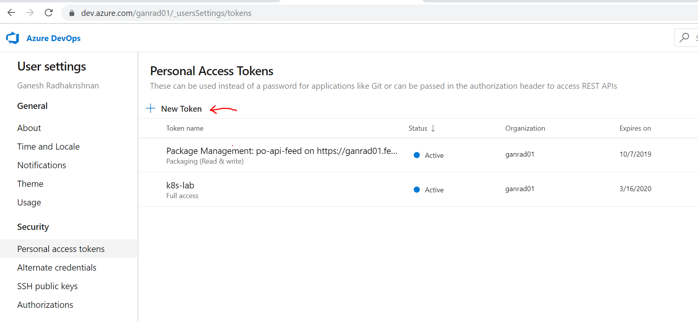
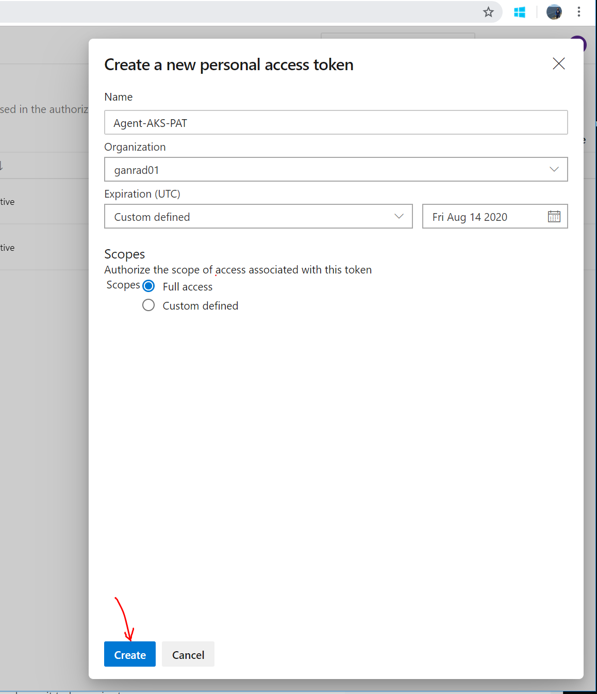
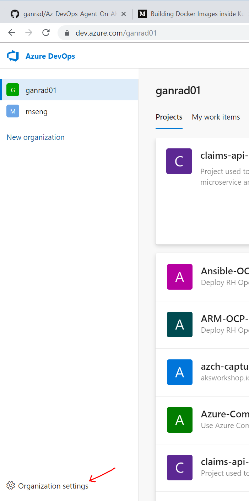
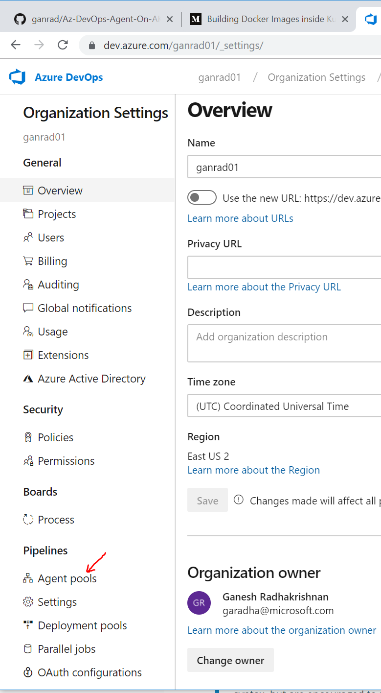
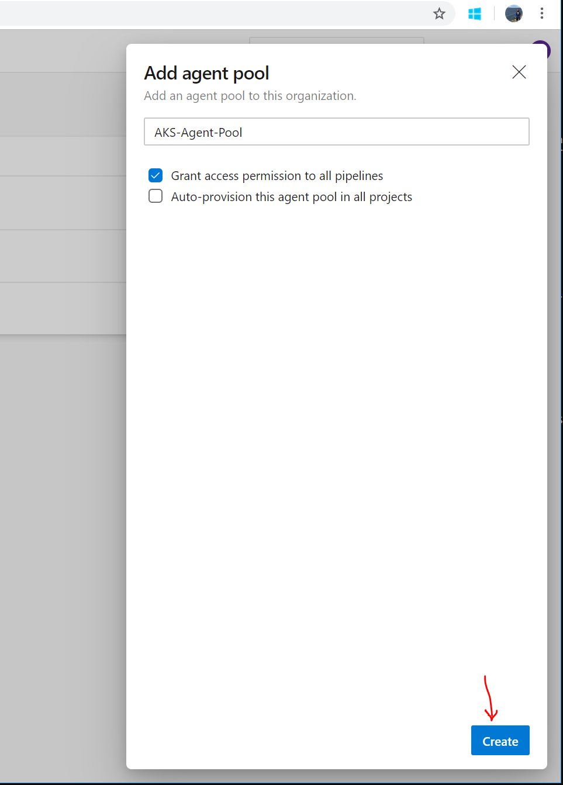
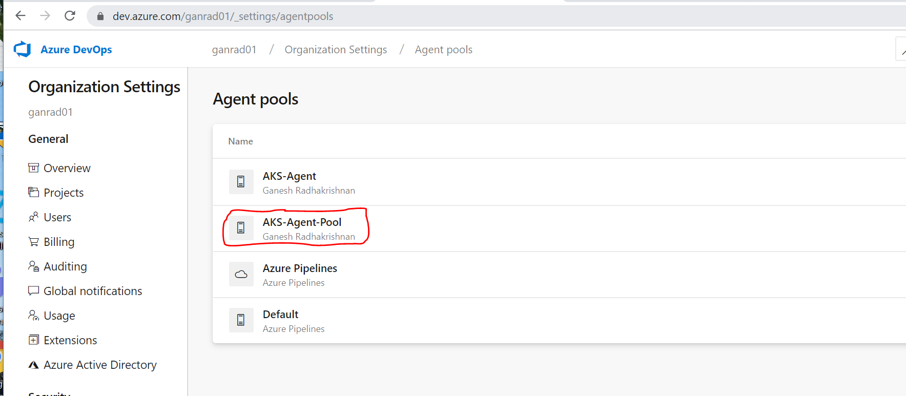
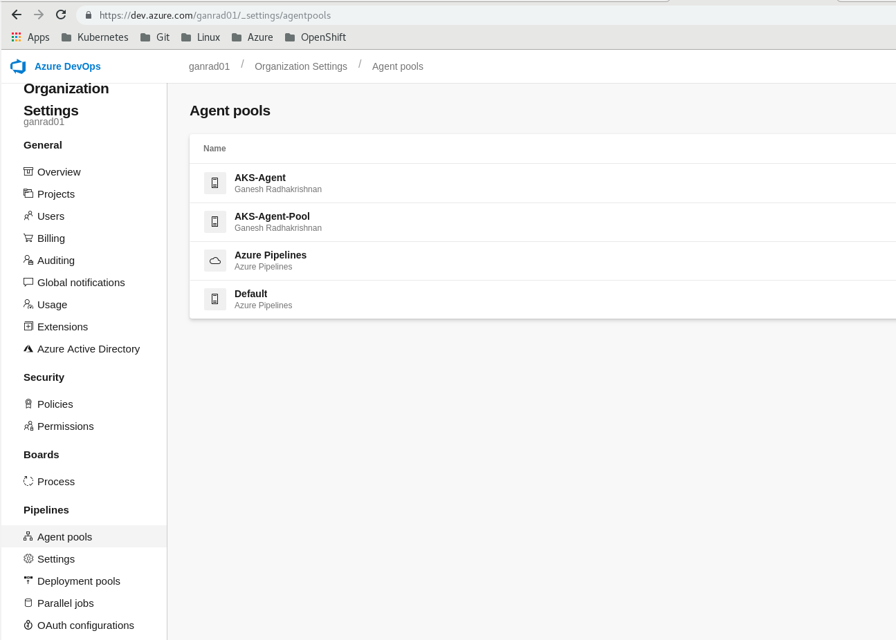
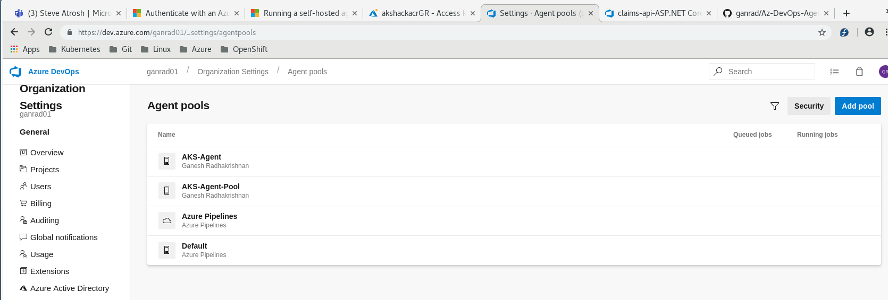
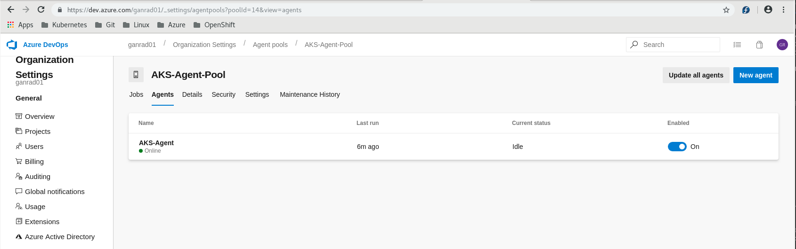

# Build and deploy Azure DevOps Pipeline Agent on AKS

### Description:
This project details the steps for customizing the Azure DevOps Pipeline Agent and deploying the same on Azure Kubernetes Service.  AKS is a managed kubernetes service on Azure.

### Prerequisites:
1. A Linux VM with the following tools installed.
   - Azure CLI
   - Kubernetes CLI (kubectl)
   - Docker engine
   - Helm CLI (Kubernetes Package Manager)

2. A Microsoft Azure Account and access to the Azure Portal

3. An Azure DevOps Services account and access to the Azure DevOps Services Portal

4. Access to a Azure Container Registry (ACR) instance

5. Access to an Azure Kubernetes Cluster (AKS) instance.

### A] Create PAT token and Agent Pool in Azure DevOps Services

1. Login to Azure DevOps Services portal with your credentials

2. Create a *PAT* token
   Click on your profile name (top right corner) and then click on **Security**.  Click on **+ New Token**. See screenshot below.

   

   In the *Create a personal access token* window, specify a name for the PAT Token, set the **Expiration** field to **Custom defined** and select an expiry date.  Set the **Scopes** field to **Full access**.  Then click on **Create**.  See screenshot below.

   

   Copy and save the PAT token.  The token won't be accessible once the window is closed.

   

2. Create an *Agent Pool*
   Open up the Azure DevOps organization tab and then click on **Organization settings** (lower left corner).  See screenshot below.   

   

   Then click on **Agent pools* as shown in the screenshot below.

   

   Click on **Add pool**, specify a name for the agent pool and check the box for **Grant access permission to all pipelines**.  Click on **Create**.  See screenshots below.

   

   

### B] Build Azure DevOps Pipeline Agent and push it to Azure Container Registry (ACR)

Login to the Linux VM (via SSH) containing the CLI tools (outlined in the *Prerequisites* section) before proceeding with the next steps.

1. Download (Copy) the Azure DevOps Pipeline Agent

   Refer to [Azure DevOps docs](https://docs.microsoft.com/en-us/azure/devops/pipelines/agents/docker?view=azure-devops) and follow the steps to copy the `Dockerfile` and `start.sh` scripts to a local VM with **docker** engine installed on it.  These files are also provided in the `./dockeragent` directory.

2. Build the Azure DevOps Pipeline agent

   ```
   # Change directory to './dockeragent'
   $ cd ./dockeragent
   #
   # Build the Azure DevOps Pipeline Agent
   $ docker build -t azdevopsagent:latest .
   #
   # List the docker images
   $ docker images
   #
   ```

3. Push the Azure DevOps Pipeline Agent container image to ACR

   ```
   # NOTE: Substitute the correct value for ACR ('<acrName>') in the commands below
   #
   # Login to ACR with your credentials.
   $ az acr login --name <acrName>
   #
   # Tag the Azure DevOps Pipeline image 
   $ docker tag azdevopsagent:latest <acrName>.azurecr.io/azdevopsagent:v1
   #
   # List the docker images
   $ docker images
   #
   # Push the image to ACR
   $ docker push <acrName>.azurecr.io/azdevopsagent:v1
   #
   # List the images in the ACR repository
   $ az acr repository list --name <acrName> -o table
   #
   # List the tags in the 'azdevopsagent' repository
   $ az acr repository show-tags --name <acrName> --repository azdevopsagent -o table
   #
   ```

### C] Test the Azure DevOps Pipeline Agent on a local VM

1. Run the Azure DevOps Pipeline Agent
   
   ```
   #
   # Provide correct values for the following parameters
   #
   # AZP_URL = Azure DevOps URL eg., https://dev.azure.com/org
   # AZP_TOKEN = Azure DevOps PAT Token
   # AZP_AGENT_NAME = Any meaningful name for the container agent
   # AZP_POOL = Name of the agent pool registered in Azure DevOps Services.  Default value is 'Default' pool
   #
   # Use docker bind mount for running docker builds within the docker agent container! Add the '-v' option as below.
   # -v /var/run/docker.sock:/var/run/docker.sock
   #
   $ docker run -e AZP_URL="<Azure DevOps URL>" -e AZP_TOKEN="<Azure DevOps PAT Token>" -e AZP_AGENT_NAME="Az-DevOps-Agent" -e AZP_POOL="<Azure DevOps Agent Pool name>" azdevopsagent:latest
   #
   ```

2. Verify the agent has registered with the correct pool in Azure DevOps Services

   Login to Azure DevOps Services Portal with your credentials.  Click on **Organization Settings** and then click on **Agent pools**.  See screenshot below.

   

   From the agent pool list, select the pool the agent is connected to.

   

   Click on the **Agents** tab and make sure the agent is online.  See screenshot below. 

   

### D] Deploy Azure DevOps Pipeline Agent on AKS
In this step *Helm*, a Kubernetes package manager will be used to deploy the Azure DevOps Pipeline agent on AKS.

1. Update the following values in *Helm* chart file `./devops-agent/values.yaml`

   | Parameter Name | Description |
   |----------------|-------------|
   | **azpUrl** | Azure DevOps URL eg., https://dev.azure.com/org-name |
   | **azpToken** | Azure DevOps PAT Token (Created in Step A.2 |
   | **azpAgentName** | A meaningful name assigned to the pipeline agent container (a String value) |
   | **azpPool** | Name of the agent pool registered in Azure DevOps Services.  Defaults to 'Default' pool |

2. Deploy the Azure DevOps Pipeline Agent on AKS

   You must have `kubectl` and `helm` configured and connected to the AKS cluster.

   ```
   #
   # Create a new namespace 'az-devops'
   $ kubectl create namespace az-devops
   #
   # Deploy the Azure Pipeline Agent
   $ helm install ./devops-agent/ --namespace az-devops -n az-devops
   #
   # List the helm application deployments
   $ helm list
   #
   # List the Pods in 'az-devops' namespace
   $ kubectl get pods -n az-devops
   #
   # View the agent container logs
   $ kubectl logs <Pod-Name> -n az-devops
   1. Determining matching Azure Pipelines agent...
   2. Downloading and installing Azure Pipelines agent...
   3. Configuring Azure Pipelines agent...

   >> End User License Agreements:

   Building sources from a TFVC repository requires accepting the Team Explorer Everywhere End User License Agreement. This step is not required for building sources from Git repositories.

   A copy of the Team Explorer Everywhere license agreement can be found at:
     /azp/agent/externals/tee/license.html


   >> Connect:

   Connecting to server ...

   >> Register Agent:

   Scanning for tool capabilities.
   Connecting to the server.
   Successfully replaced the agent
   Testing agent connection.
   2019-08-18 01:29:29Z: Settings Saved.
   4. Running Azure Pipelines agent...
   Starting Agent listener interactively
   Started listener process
   Started running service
   Scanning for tool capabilities.
   Connecting to the server.
   2019-08-18 01:29:32Z: Listening for Jobs
   #

   ```
3. Verify the agent has registered with the correct pool in Azure DevOps Services

   Refer to Step C.2 (above).
   
### Summary
To recap, this project detailed the steps for customizing the *Azure DevOps Pipeline Agent* (use a custom Dockerfile), building and testing the agent locally on a Linux VM and then deploying the agent container on AKS.
By running multiple Azure DevOps Pipeline agent instances (containers) on AKS, multiple build jobs can be run concurrently in parallel and an organization's application build infrastructure can be elastically scaled. 

The END.
